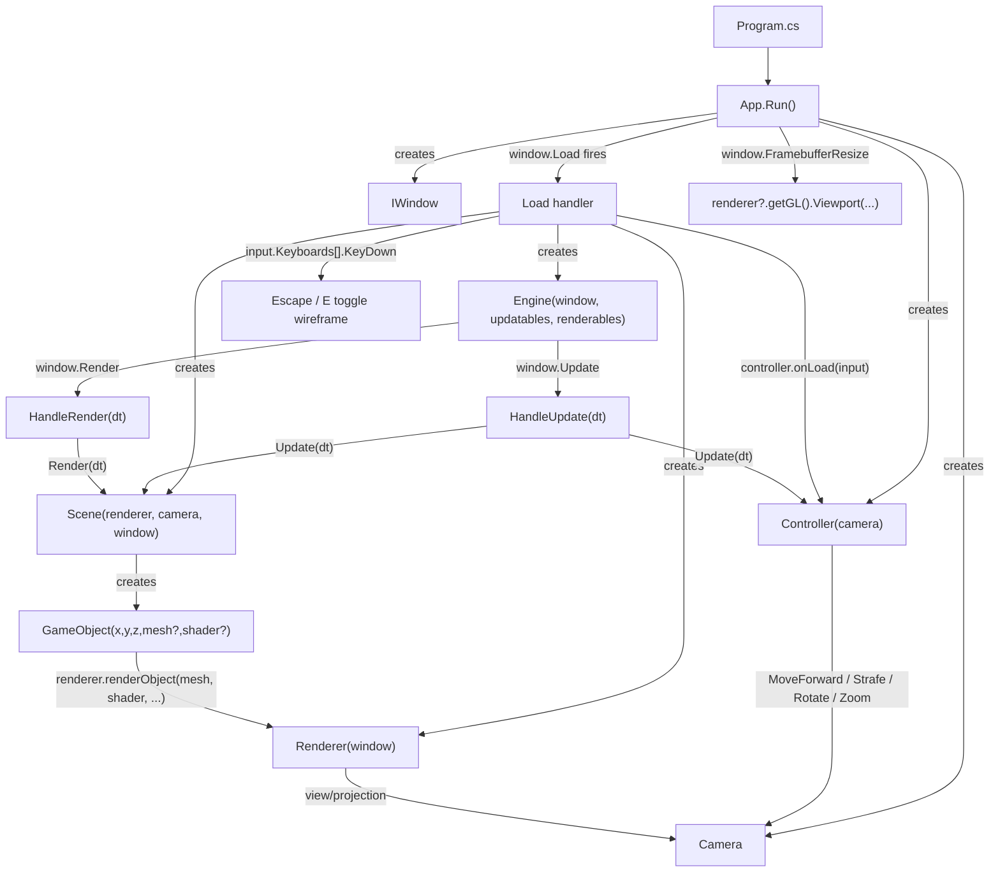

```mermaid
flowchart TB
    Program["Program.cs"] --> App["App.Run()"]
    App -- creates --> Window["IWindow"] & Camera["Camera"] & Controller["Controller(camera)"]
    App -- "window.Load fires" --> Load["Load handler"]
    Load -- creates --> Renderer["Renderer(window)"] & Scene["Scene(renderer, camera, window)"] & Engine["Engine(window, updatables, renderables)"]
    Load -- "input.Keyboards[].KeyDown" --> KeyDown["Escape / E toggle wireframe"]
    Load -- "controller.onLoad(input)" --> Controller
    Engine -- "window.Update" --> HandleUpdate["HandleUpdate(dt)"]
    Engine -- "window.Render" --> HandleRender["HandleRender(dt)"]
    HandleUpdate -- Update(dt) --> Controller & Scene
    Controller -- MoveForward / Strafe / Rotate / Zoom --> Camera
    HandleRender -- Render(dt) --> Scene
    Renderer -- view/projection --> Camera
    App -- "window.FramebufferResize" --> Resize["renderer?.getGL().Viewport(...)"]
    Scene -- "creates" --> GameObject["GameObject(x,y,z,mesh?,shader?)"]
    GameObject -- "renderer.renderObject(mesh, shader, ...)" --> Renderer
```